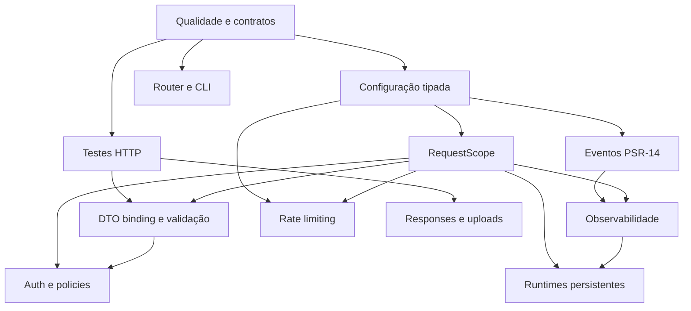

# NeoFramework — Especificação e caminho de implementação

Status: implementação concluída — ver §4.1
Última atualização: 2026-09-01
Escopo: NeoFramework Core, skeleton e integrações oficiais
Base: PHP 8.4, PSR-3, PSR-7, PSR-11, PSR-14, PSR-15 e PSR-17

## 1. Objetivo

Esta especificação define o caminho para evoluir o NeoFramework depois da adoção do novo kernel HTTP, roteamento absoluto e contratos PSR. O objetivo é entregar um framework tipado, testável, extensível e seguro, preservando uma API pequena e evitando dependências obrigatórias desnecessárias.

O resultado esperado é uma plataforma que ofereça:

- ciclo HTTP sem estado global por requisição;
- rotas, DTOs, validação e persistência fortemente tipados;
- autenticação e autorização integradas;
- configuração compilável e tipada;
- observabilidade e extensibilidade por eventos;
- experiência de desenvolvimento competitiva por CLI e testes HTTP;
- suporte seguro a PHP-FPM e runtimes persistentes.

## 2. Princípios de arquitetura

1. **Interfaces nos limites:** componentes internos dependem de PSRs e interfaces do Core, não de implementações concretas.
2. **Imutabilidade HTTP:** mensagens PSR-7 nunca são alteradas sem guardar o valor retornado.
3. **Escopo explícito:** todo estado de uma requisição pertence a um `RequestScope` descartável.
4. **Falha antecipada:** configuração, rotas e bindings inválidos falham no bootstrap ou na compilação.
5. **Recursos opcionais:** OpenTelemetry, Redis, processamento de imagem e runtimes persistentes entram por adapters opcionais.
6. **Compatibilidade planejada:** toda quebra pública exige seção no `UPGRADE.md`, mensagem de depreciação quando possível e teste de migração.
7. **Zero mágica invisível:** binding, validação e resolução automática devem produzir erros claros e ser inspecionáveis pela CLI.

## 3. Dependências entre iniciativas



## 4. Ordem recomendada

| Fase | Entrega | Depende de | Status |
|---|---|---|---|
| 0 | Qualidade, contratos e baseline | — | ✅ |
| 1 | Router, CLI e testes HTTP | 0 | ✅ |
| 2 | Configuração tipada e cache | 0 | ✅ |
| 3 | RequestScope e remoção de estado global | 2 | ✅ |
| 4 | DTO binding, validação e Problem Details | 1, 3 | ✅ |
| 5 | Auth, guards e policies | 3, 4 | ✅ |
| 6 | Eventos, logs e observabilidade | 2, 3 | ✅ |
| 7 | Rate limiting, uploads e responses avançadas | 1, 2, 3 | ✅ |
| 8 | Runtimes persistentes | 3, 6 | ✅ PHP-FPM, FrankenPHP, RoadRunner e Swoole validados no processo real, com job próprio no CI |
| 9 | Modularização e estabilização | todas | ✅ |

Legenda: ✅ feito · 🟡 parcial · ⬜ pendente

## 4.1 Estado atual

Baseline verificável em qualquer commit: `composer test:all` — **582 testes, 12.350 asserções,
zero pulados**, PHPStan limpo, style limpo e suíte verde em ordem aleatória.

A suíte roda em `docker compose exec php`. A imagem carrega `intl` com `icu-data-full`:
sem os dados de locale o `intl` existe e formata tudo como `en_US` — uma falha que passa
por bug de código e é de imagem. `ext-intl` agora está declarado no `composer.json`.

### Base HTTP — concluída antes deste roadmap

Kernel PSR-15, roteamento absoluto com `#[Route]`/`#[RoutePrefix]`, `Request`/`Response`
PSR-7, hierarquia de exceptions HTTP com negociação de conteúdo, PSR-11 no container e
PSR-3 no logger.

### Fase 0 — ✅

| Item | Estado |
|---|---|
| PHPStan 2 no Core | ✅ nível 5, com baseline de 6 erros legados |
| `declare(strict_types=1)` | ✅ em `src/` e agora também em `tests/` — 12 arquivos de teste não tinham |
| Ordem aleatória no CI | ✅ |
| Scripts Composer | ✅ `test`, `test:types`, `test:style`, `style:fix`, `test:all` |
| PHP-CS-Fixer | ✅ `.php-cs-fixer.dist.php` versionado, 104 arquivos normalizados |
| Matriz de versões de dependências | ✅ CI roda `lowest` e `highest` |
| Infection | ✅ `composer test:mutation` sobre Routing, Http e Validation; MSI coberto ~80%, piso de 70 no CI |
| Cobertura de linhas | ✅ `composer test:coverage` exige 90% no código 2.x mantido (90,06% na baseline) |
| Política de compatibilidade semântica | ✅ `docs/COMPATIBILITY.md` |

O baseline caiu de 45 para 6 entradas, hoje concentradas em `Abstract/Layout.php`,
`Session.php` e `Email.php` — `Functions.php` e `FileStorage.php` saíram dele nas extrações
da §20. Não baseline erro novo: o CI existe para isso.

O conjunto de regras do PHP-CS-Fixer é deliberadamente estreito. Este código usa
`if (...) return x;` numa linha em toda parte, e um preset como `@PSR12` reescreveria
milhares de linhas só para impor chaves — trocando um estilo consistente por outro e
enterrando qualquer diff de verdade no processo. As regras pegam o que é objetivamente
errado (import morto, espaço no fim da linha, `array()`, `declare` faltando), não
preferência.

### Fase 1 — ✅

| Item | Estado |
|---|---|
| `route:list` com saída humana e JSON | ✅ |
| Prefixo de path (`#[RoutePrefix]`) | ✅ |
| Validação de var de rota contra parâmetro da action, na compilação | ✅ |
| Recusa de nome e de rota duplicados | ✅ apenas duplicata exata |
| `TestClient` / `TestResponse` / `HttpTestCase` | ✅ |
| Cookie jar entre requisições | ✅ |
| Helpers JSON e form | ✅ |
| Sessão isolada por cliente | ✅ via `RequestScope` (Fase 3) |
| CSRF e identidade de teste | ✅ `withCsrfToken()` e `actingAs()` |
| Multipart e uploads no kit | ✅ `postMultipart()` e `TestClient::uploadedFile()` |
| Fakes (jobs, e-mail, eventos, cache, relógio, storage) | ✅ `FakeQueue`, `FakeMailer`, `FakeDispatcher`, `FakeCache`, `FakeClock`, `InMemoryDisk` |
| Transação de banco por teste | ✅ trait `DatabaseTransactions`, exercitada contra o Postgres do compose e do CI |
| Prefixo de **nome** em `#[RoutePrefix]` | ✅ |
| Geração de URL absoluta | ✅ `route_url()`, exige `app.url` |
| URLs assinadas (HMAC) | ✅ `signed_route()`, com expiração e query assinada |
| Validação de constraint na geração de URL | ✅ |
| `OPTIONS` automático | ✅ 204 + `Allow`, sem executar controller |
| Rotas inalcançáveis como erro de `route:cache` | ✅ `RouteConflictDetector` |
| Grupos de rotas / API programática | ✅ `RouteRegistrar` + `Config/routes.php`, na mesma coleção das rotas de atributo |
| Host e subdomínio (`#[RouteHost]`) | ✅ constraint padrão `[^.]+`, balde estático próprio, host na geração de URL |
| Prioridade explícita e defaults | ✅ `priority:` e `defaults:` no `#[Route]` |
| Fallback (`#[RouteFallback]`) | ✅ substitui o 404, nunca o 405 |

### Fase 2 — ✅

`ConfigRepositoryInterface`, defaults internos da biblioteca, arquivos `Config/*.php` do
projeto-skeleton, objetos de configuração por domínio, cache atômico e os comandos
`config:validate`, `config:cache`, `config:clear` e `config:list` foram adicionados. O cache
vence os arquivos-fonte até ser limpo, `config:list` mascara chaves sensíveis e o logger aplica
redaction a mensagens e contextos. O bootstrap valida todos os domínios antes de criar o
container; as integrações de cache, sessão, URL, rotas, Vite, templates, filas, e-mail,
criptografia e storage agora consomem objetos tipados. Uma regra do PHPStan proíbe `env()` fora
dos arquivos de configuração.

### Fase 3 — ✅

Cada chamada a `HttpKernel::handle()` cria um `RequestScope` descartável, propaga-o como
atributo PSR-7 e o encerra em `finally`. Request, rota casada, variáveis de rota, sessão,
request ID e contexto de logs pertencem a esse escopo. O container não recebe mais binding
mutável de request; a suíte processa 200 requisições alternadas e também cobre limpeza após
exceção de middleware.

### Fase 4 — ✅

`DtoBinder` faz bind por construtor com cast de escalares e enums backed; `ValidationException`
e Problem Details (RFC 9457) com `requestId` estão prontos. As regras saíram de um `if`-chain
dentro do binder para trás de `ValidatorInterface`: o atributo declara um `RuleSpec`, a Respect
Validation é o motor padrão, e adicionar uma regra não toca mais no binder.

O metadata compilado completa o caminho:

| Item | Estado |
|---|---|
| `#[FromBody]` `#[FromQuery]` `#[FromRoute]` `#[FromHeader]` | ✅ origem por campo, com chave opcional; `AttributeLoader` reconhece var consumida por `#[FromRoute]` |
| `#[Sensitive]` | ✅ registra o campo no escopo; `Logger` redige por nome além do regex padrão |
| Regras de validação | ✅ `#[Rule]` alcança o catálogo do motor; `ValidatorInterface` isola a biblioteca |
| DTOs aninhados, listas e datas | ✅ `#[ListOf]`, DTOs readonly e RFC 3339/`Y-m-d`; erros usam caminhos indexados |
| Metadata cache compilável | ✅ `DtoMetadata` + `neof dto:cache`; plano por classe, sem Reflection no bind |

O critério de aceite da §10 — "passwords, tokens e campos marcados como sensíveis não aparecem
no erro/log" — está cumprido: o valor recusado nunca entra na resposta de validação e o campo
marcado é redigido no log. O motor recebe o nome do campo explicitamente porque, sem ele, a
Respect usa o próprio valor como rótulo da mensagem — numa regra como `in`, a senha apareceria
na resposta 422. Há teste de regressão.

### Fase 5 — ✅

O Core agora expõe contratos independentes de ORM para identidade, provider, guard,
tokens e policies. `SessionGuard` rotaciona a sessão e o CSRF no login e invalida a
sessão no logout. `BearerTokenGuard` emite somente tokens opacos, persiste hash SHA-256,
tem expiração, escopos, revogação e refresh. `#[Authenticated]`, `#[Authorize]` e
`#[CurrentUser]` integram esses contratos às actions; 401 e 403 seguem Problem Details.
`TestClient::actingAs()` isola a identidade por cliente, e policies são testáveis fora
do HTTP. Veja `docs/AUTH.md` para a integração da aplicação.

### Fase 6 — ✅

| Item | Estado |
|---|---|
| Dispatcher PSR-14 síncrono + `ListenerProvider` com prioridade | ✅ |
| Eventos `RequestReceived`, `RouteMatched`, `ResponseCreated`, `ExceptionRaised` | ✅ |
| Listener inválido falha no registro, não no dispatch | ✅ |
| `event:list` (humano e `--json`) | ✅ |
| Custo mínimo sem listener (no-op) | ✅ |
| Dispatcher substituível pelo container | ✅ |
| Request ID gerado, ou herdado de proxy confiável e saneado | ✅ |
| `X-Request-Id` na resposta e `requestId` no Problem Details | ✅ |
| Log JSON, `stderr`/`stdout`, nível e canais por configuração | ✅ |
| Redaction por nome e por `#[Sensitive]` | ✅ |
| Eventos de jobs, migrations e auth | ✅ com escopo por job, que também os tornou possíveis |
| `MetricsExporterInterface` + no-op, memória e `HttpMetricsListener` | ✅ latência, status e rota |
| Métricas de fila | ✅ `QueueMetricsListener`, separando retry de desistência |
| Métricas de cache e de query | ✅ `CacheAccessed` e `QueryExecuted` com seus listeners; a de query exige `InstrumentedPdo` (a NeoORM não despacha) |
| `TracerInterface` e `SpanInterface` com no-op | ✅ |
| Adapter OpenTelemetry | ✅ `packages/opentelemetry`, API OTel opcional |
| Debug toolbar | ✅ `/_debug/{token}`, só fora de produção, guardando agregados e não conteúdo |
| Cache de listeners compilado | ✅ `neof event:cache`; closure reprova a compilação em vez de sumir |

### Fase 7 — ✅

| Item | Estado |
|---|---|
| `RateLimiterInterface` e `RateLimitStoreInterface` | ✅ |
| Fixed window em cache | ✅ baseline; documentado como não-atômico |
| Redis atômico | ✅ `RedisRateLimitStore`, INCR + EXPIREAT em um script Lua |
| Sliding window | ✅ dois contadores ponderados, sem log de timestamps |
| Middleware e atributo | ✅ |
| `RateLimit-*` e `Retry-After` | ✅ |
| Políticas nomeadas em configuração | ✅ `Config/rate_limit.php`, validadas no bootstrap |
| Fail-open / fail-closed | ✅ `ResilientRateLimiter`, com log sem a chave |
| Relógio injetável | ✅ `Testing\FakeClock` |
| Limites padrão no Auth | ✅ `LoginThrottle` conta falhas por identificador e por IP; política `login` declarada por padrão |
| Uploads PSR-7 e streaming | ✅ `storeUploadedFile()`, limite aplicado durante a leitura, extensão vinda do MIME detectado |
| Contract test de discos (local, S3, memória) | ✅ S3 roda contra o MinIO do compose — o adapter nunca tinha sido executado |
| Hook de scanner | ✅ `UploadScannerInterface` sobre o temporário, antes da gravação |
| Range, 206 e 416 | ✅ inclusive `If-Range` obsoleto voltando ao arquivo inteiro |
| ETag, `Last-Modified` e 304 | ✅ `ConditionalRequest` + middleware; comparação fraca |
| `Cache-Control` e `Cookie` tipados | ✅ |
| Streaming, JSON stream e SSE | ✅ `CallbackStream`; o emitter passou a enviar por blocos |
| Adapter de imagem | ✅ `packages/image`, GD + EXIF opcionais, reencode WebP |

Duas falhas silenciosas foram fechadas junto: o store de cache — o binding **padrão** —
passava chaves com `:` e `/` para o PSR-6, que as recusa, de modo que toda rota limitada
respondia 500; e `#[RateLimit(policy: '...')]` apontando para política inexistente só
falhava ao servir a rota, agora é erro de `route:cache`.

### Entregue fora do roadmap

- **Base path (`APP_BASE_PATH`)** — instalação em subdiretório era irroteável.
- **`bin/neof` resolvia o autoloader errado** sob path repository com symlink: a descoberta
  de controllers não achava nada e `route:cache` gravava mapa vazio, publicando uma
  aplicação que respondia 404 em tudo.
- **Correções no compilador de rotas** — opcional que nunca casava, placeholder inválido
  compilado como literal morto, `%2F` forjando fronteira de segmento, parâmetro inválido
  do cliente devolvendo 500 em vez de 400, erro de `preg_match` virando 404 silencioso.
- **Oito coerções de tipo** que `strict_types` converteria em `TypeError` em produção,
  incluindo seis que quebrariam o driver Redis de filas.
- **`bin/neof` e o skeleton ainda chamavam `Functions`**, removida na §20: a CLI inteira
  e `public/index.php` morriam com "Class not found" antes de qualquer comando rodar.
- **Store de cache do rate limit rejeitado pelo PSR-6** — o binding padrão passava chaves
  com `:` e `/`, então toda rota com `#[RateLimit]` respondia 500.
- **`ext-intl` não declarado**, embora `Support\Date::localized()` e `Support\Money::format()`
  dependam dele; em Alpine, faltava também `icu-data-full`, que faz o `intl` formatar tudo
  em `en_US` sem erro nenhum.

---

# Fase 0 — Qualidade e contratos

## 5. Análise estática e padronização

### Objetivo

Criar um baseline confiável antes de aumentar a superfície pública.

### Implementação

1. ✅ Adicionar PHPStan 2 ao Core e configurar nível máximo progressivo.
2. ✅ Adicionar `declare(strict_types=1)` a todos os arquivos de primeira parte.
3. ✅ Configurar PHP-CS-Fixer com regras versionadas no repositório.
4. ✅ Adicionar scripts Composer:

```json
{
  "scripts": {
    "test": "phpunit",
    "test:types": "phpstan analyse",
    "test:style": "php-cs-fixer check --diff",
    "test:all": ["@test:style", "@test:types", "@test"]
  }
}
```

5. ✅ Executar testes em ordem aleatória no CI após isolar as fixtures de jobs.
6. ✅ Adicionar matriz para menor e maior versão suportada das dependências.
7. ✅ Adicionar Infection, começando por Routing, HTTP e Validation.
8. ✅ Definir política de compatibilidade semântica e ciclo de depreciação — `docs/COMPATIBILITY.md`.

### Critérios de aceite

- ✅ `composer test:all` retorna zero em ambiente limpo, e agora roda estilo de verdade;
- ✅ nenhum erro PHPStan novo pode entrar no `main`;
- ✅ testes não dependem da ordem;
- ✅ APIs públicas possuem tipos de retorno e parâmetros completos;
- ✅ CI valida Core e skeleton; o workflow do skeleton instala os path repositories,
  valida o manifesto, faz lint e executa `neof about --json`.

---

# Fase 1 — Router, CLI e testes HTTP

## 6. Evolução do Router

### Funcionalidades

- grupos de rotas;
- prefixos de path e nome;
- restrição por host/subdomínio;
- defaults de parâmetros opcionais;
- geração de URL absoluta;
- URLs assinadas e temporárias;
- redirects e fallback;
- `OPTIONS` automático;
- prioridade explícita;
- validação da URL gerada contra a regex compilada;
- inspeção por `route:list`.

### API proposta

```php
#[RoutePrefix('/api/v1', name: 'api.v1.')]
#[RouteHost('{tenant}.example.com')]
final class UserController extends Controller
{
    #[Route('/users/{id:\\d+}', ['GET'], name: 'users.show')]
    public function show(int $id): Response {}
}
```

Também deve existir uma API programática opcional:

```php
$routes->group('/admin', function (RouteCollection $routes): void {
    $routes->get('/users', [UserController::class, 'index'])
        ->name('admin.users.index')
        ->middleware(AdminOnly::class);
});
```

### Caminho de implementação

1. ✅ Expandir `RouteDefinition` com `host`, `defaults` e `priority`. `schemes` ficou de fora: a escolha entre http e https pertence ao servidor da frente, e uma rota que só existe em https é redirect, não roteamento.
2. ✅ Fazer `PatternCompiler` produzir compilados separados para path e host.
3. ✅ Fazer `RouteCompiler` ordenar rotas por prioridade e ordem de declaração.
4. Fazer `Matcher` retornar `OPTIONS` e `Allow` sem executar controllers.
5. Fazer `UrlGenerator` validar parâmetros e constraints antes de gerar a URL.
6. Criar `SignedUrlGenerator` usando HMAC e chave da aplicação.
7. ✅ Criar atributos `RouteHost`, `RouteFallback` e suporte a prefixo de nome.
8. Implementar `route:list`, com saídas humana e JSON.
9. Incluir conflitos e rotas inalcançáveis como erro de `route:cache`.

### Critérios de aceite

- ✅ uma rota inalcançável é recusada por `route:cache` — sobreposição parcial não é
  reportada, porque `{id:\d+}` antes de `{slug:[a-z]+}` é desenho legítimo;
- ✅ `OPTIONS` lista os métodos válidos, respondido pelo matcher;
- ✅ URL assinada expirada ou alterada é recusada, e a query faz parte do que é assinado;
- ✅ `route:list --json` é estável para consumo por ferramentas;
- ✅ matcher não usa Reflection em produção.

Ver `docs/ROUTING.md`.

## 7. Kit de testes HTTP

### API proposta

```php
$response = $this->actingAs($user)->postJson('/users', [
    'email' => 'neo@example.com',
]);

$response
    ->assertCreated()
    ->assertJsonPath('email', 'neo@example.com')
    ->assertHeader('Location');
```

### Componentes

- `FrameworkTestCase`;
- `TestClient` que chama o `HttpKernel` sem servidor real;
- `TestResponse` com assertions;
- cookie jar e sessão isolada;
- helpers de JSON, forms, multipart e uploads;
- autenticação e CSRF de teste;
- fakes de jobs, e-mail, eventos, cache, relógio e storage;
- transação de banco por teste quando suportada.

### Caminho de implementação

1. Criar `Testing\TestClient` sobre `HttpKernel::handle()`.
2. Criar `Testing\TestResponse`, sem estender a resposta de produção.
3. Criar `Testing\ApplicationFactory` para montar container e config isolados.
4. Introduzir adapters fake por interfaces.
5. Migrar os testes internos do Core para usar o mesmo kit público.
6. Documentar exemplos de controller, middleware, sessão e API.

### Critérios de aceite

- nenhum teste HTTP depende de superglobais;
- dois clientes podem manter sessões independentes no mesmo processo;
- testes não emitem headers nem output;
- o kit funciona em PHPUnit sem exigir banco ou Redis.

---

# Fase 2 — Configuração tipada

## 8. Repositório de configuração

### Objetivo

Eliminar leituras de `env()` espalhadas durante o runtime.

### Arquitetura

```php
interface ConfigRepositoryInterface
{
    public function get(string $key, mixed $default = null): mixed;
    public function require(string $key): mixed;
}
```

Objetos tipados representam domínios:

- `AppConfig`;
- `HttpConfig`;
- `SessionConfig`;
- `CacheConfig`;
- `LoggingConfig`;
- `CorsConfig`;
- `SecurityHeadersConfig`;
- `QueueConfig`;
- `DatabaseConfig`.

### Caminho de implementação

1. Ler `.env` somente no bootstrap.
2. Criar arquivos `Config/*.php` que retornem arrays sem chamar serviços.
3. Criar schema com conversão e validação de tipos.
4. Registrar objetos de configuração no container.
5. Migrar componentes, um por vez, de `env()` para construtores tipados.
6. Implementar `config:validate`, `config:cache` e `config:clear`.
7. Impedir `env()` fora dos arquivos de configuração por regra PHPStan.
8. Ocultar secrets em `config:list` e logs.

### Critérios de aceite

- configuração inválida impede o bootstrap com mensagem específica;
- produção não interpreta `.env` depois de `config:cache`;
- mudanças no `.env` não alteram uma aplicação com cache até `config:clear`;
- nenhuma classe de domínio chama `env()` diretamente.

---

# Fase 3 — RequestScope e estado

## 9. Escopo por requisição

### Problema

Single­tons estáticos e bindings mutáveis podem vazar request, usuário, sessão e contexto entre execuções em processos persistentes.

### Arquitetura proposta

```php
interface RequestScopeInterface
{
    public function set(string $id, mixed $value): void;
    public function get(string $id): mixed;
    public function reset(): void;
}
```

O escopo contém:

- request e response factory;
- usuário autenticado;
- sessão;
- route match;
- request ID;
- contexto de logs;
- Unit of Work e conexões transacionais por request.

### Caminho de implementação

1. Criar container raiz imutável para serviços compartilháveis.
2. Criar child container ou resolver scoped por request.
3. Construir o escopo no início de `HttpKernel::handle()`.
4. Encerrar o escopo em `finally`, inclusive após exceções.
5. Migrar o binding atual de `ServerRequestInterface` para o escopo.
6. Remover estado estático de `Cache`, `Logger`, `Session` e `RouteCache` onde representar request.
7. Adicionar contrato `ResettableInterface` para integrações compartilhadas.
8. Criar teste que processa centenas de requests alternados no mesmo processo e verifica ausência de vazamento.

### Critérios de aceite

- request A nunca observa dados do request B;
- o escopo é limpo mesmo quando middleware ou controller lança exceção;
- serviços compartilhados são explicitamente marcados como stateless/resettable;
- o kernel suporta múltiplas chamadas no mesmo processo.

---

# Fase 4 — DTO binding, validação e erros HTTP

## 10. Binding automático de DTOs

### API proposta

```php
final readonly class CreateUserRequest
{
    public function __construct(
        #[Email]
        public string $email,
        #[Length(min: 8)]
        public string $password,
        public UserRole $role = UserRole::User,
    ) {}
}

#[Route('/users', ['POST'])]
public function store(CreateUserRequest $input): Response {}
```

### Pipeline

1. escolher fonte pelo método e content type;
2. mesclar route params apenas quando explicitamente configurado;
3. normalizar nomes;
4. converter escalares, enums, datas, arrays e DTOs aninhados;
5. validar;
6. construir objeto readonly;
7. lançar `ValidationException` com erros por campo.

### Componentes

- `InputMapperInterface`;
- `TypeCasterInterface`;
- `ValidatorInterface`;
- `MetadataFactory` com cache;
- `DtoArgumentResolver` integrado ao `ArgumentResolver`;
- atributos de source: `FromBody`, `FromQuery`, `FromRoute`, `FromHeader`;
- ✅ atributos de validação sobre `ValidatorInterface`, com a Respect Validation
  como motor padrão — o atributo declara um `RuleSpec`, a biblioteca fica atrás do
  contrato e sai trocando uma classe.

### Caminho de implementação

1. Extrair o casting atual do `ArgumentResolver` para uma cadeia de casters.
2. Implementar metadata por Reflection com cache compilável.
3. Suportar DTOs simples e enums.
4. Adicionar objetos aninhados, listas e datas.
5. ✅ Integrar validação e tradução de mensagens.
6. Adicionar geração opcional de schema OpenAPI a partir da mesma metadata.
7. Integrar tipos gerados pelo NeoORM sem criar dependência circular.

### Critérios de aceite

- entrada inválida nunca chega ao controller;
- erro informa caminho completo, regra e valor seguro;
- passwords, tokens e campos marcados como sensíveis não aparecem no erro/log;
- DTOs aninhados e listas possuem erros indexados;
- metadata não é recalculada por request em produção.

## 11. Hierarquia de exceptions e Problem Details

### Exceptions mínimas

- `BadRequestException` — 400;
- `UnauthorizedException` — 401;
- `ForbiddenException` — 403;
- `NotFoundException` — 404;
- `MethodNotAllowedException` — 405;
- `ConflictException` — 409;
- `ValidationException` — 422;
- `TooManyRequestsException` — 429;
- `ServiceUnavailableException` — 503.

### Formato

Erros de API seguem RFC 9457 (`application/problem+json`). HTML continua usando páginas de erro configuráveis.

```json
{
  "type": "https://neoframework.dev/problems/validation",
  "title": "Validation failed",
  "status": 422,
  "instance": "/users",
  "requestId": "...",
  "errors": {"email": ["Email inválido"]}
}
```

### Critérios de aceite

- `Accept` escolhe corretamente JSON ou HTML;
- toda exception HTTP preserva headers obrigatórios;
- detalhes internos nunca aparecem em produção;
- erros possuem request ID correlacionável aos logs.

---

# Fase 5 — Autenticação e autorização

## 12. Auth

### Separação de responsabilidades

- **Guard:** extrai uma credencial e resolve uma identidade;
- **Provider:** carrega usuários;
- **Authenticator:** executa login/logout/refresh;
- **Authorizer:** avalia policies e abilities;
- **Identity:** contrato mínimo do usuário autenticado.

### Guards oficiais

- `SessionGuard`;
- `BearerTokenGuard` com tokens opacos e hash no banco;
- adapter JWT opcional, sem torná-lo padrão.

### API proposta

```php
#[Authenticated('session')]
#[Authorize('users.update', subject: 'user')]
public function update(User $user, UpdateUserRequest $input): Response {}
```

### Caminho de implementação

1. Definir interfaces sem acoplamento ao ORM.
2. Implementar `AuthContext` dentro do `RequestScope`.
3. Criar `SessionGuard`, login, logout e rotação do session ID.
4. Criar tokens opacos com expiração, revogação e scopes.
5. Criar registry de policies e middleware de autorização.
6. Criar atributos `Authenticated`, `Authorize` e `CurrentUser`.
7. Criar fakes para testes e helpers `actingAs()`.
8. Criar comandos de geração de policy e token.
9. Documentar proteção CSRF: sessão exige CSRF; bearer não depende de cookie.

### Requisitos de segurança

- passwords usam `password_hash()` e rehash automático;
- tokens são armazenados como hash;
- comparação usa `hash_equals()`;
- sessão rotaciona no login e mudança de privilégio;
- cookies usam Secure, HttpOnly e SameSite configuráveis;
- mensagens de login não revelam existência do usuário;
- rate limit padrão em login e recuperação de senha.

### Critérios de aceite

- guards podem coexistir na mesma aplicação;
- policies são testáveis sem HTTP;
- logout revoga sessão/token;
- tentativas de session fixation possuem teste de regressão;
- nenhuma implementação depende diretamente do NeoORM.

---

# Fase 6 — Eventos e observabilidade

## 13. Eventos PSR-14

### Eventos iniciais

- `RequestReceived`;
- `RouteMatched`;
- `ControllerInvoking` / `ControllerInvoked`;
- `ResponseCreated`;
- `ExceptionRaised`;
- ✅ `JobProcessing` / `JobProcessed` / `JobFailed`;
- ✅ `MigrationApplied`;
- ✅ `UserAuthenticated` / `UserLoggedOut`;
- ✅ `ControllerInvoking` / `ControllerInvoked` — o segundo não é despachado quando a action lança.

Ver `docs/EVENTS.md`.

Os eventos de fila só foram possíveis depois de o worker ganhar escopo. `queue:work` é
um processo que roda indefinidamente e não tinha nenhum: cada job herdava o que o
anterior deixasse no escopo estático — o vazamento que a Fase 3 fechou para o HTTP e
nunca para as filas. Sem escopo, três coisas eram silenciosamente inertes no worker:
`Events::dispatch()` não chegava a listener nenhum, o `Logger` não tinha contexto e
`AuthContext::set()` gravava no vazio. `bin/neof` abre um escopo equivalente para o
processo inteiro, e é por isso que `migration:up` consegue despachar.

### Caminho de implementação

1. Adicionar `psr/event-dispatcher` como dependência explícita.
2. Criar dispatcher síncrono mínimo e listener provider compilável.
3. Definir eventos imutáveis; eventos não devem carregar secrets.
4. Integrar pontos de dispatch sem alterar decisões de negócio silenciosamente.
5. Criar `event:list` e cache de listeners.
6. Permitir substituir o dispatcher por implementação externa.

### Critérios de aceite

- ausência de listeners tem custo mínimo;
- ordem/prioridade de listeners é determinística;
- listener inválido falha na compilação;
- eventos críticos possuem testes de dispatch e payload.

## 14. Logs, métricas e tracing

### Entregas

- request ID aceito de proxy confiável ou gerado localmente;
- logs JSON em produção e legíveis em desenvolvimento;
- `stderr` como padrão para containers;
- canais HTTP, queue, scheduler, database e security;
- contexto automático sem dados sensíveis;
- ✅ métricas de latência, status, rota, fila, cache e queries;
- ✅ adapter OpenTelemetry opcional em `packages/opentelemetry`;
- ✅ debug toolbar apenas em desenvolvimento.

### Caminho de implementação

1. Criar middleware `RequestIdMiddleware`.
2. Colocar contexto no `RequestScope` e em processors do Monolog.
3. Criar `LoggingConfig` e factories de handlers/formatters.
4. Instrumentar kernel, matcher, action, queue e NeoORM por eventos.
5. ✅ Definir `MetricsExporterInterface` e `TracerInterface` com adapters no-op.
6. ✅ Criar collector de debug e endpoint protegido da toolbar.
7. ✅ Adicionar redaction central para headers, query params e campos sensíveis.

Ver `docs/OBSERVABILITY.md`. O label de rota usa o **padrão** (`/orders/{id}`) e nunca o
path resolvido: um label de valor aberto cria uma série temporal por requisição e derruba
o backend com a própria instrumentação. A rota vem do `RequestScope` porque
`ResponseCreated` carrega o request que o kernel recebeu — o atributo anexado pelo
`RoutingHandler` vive numa cópia imutável e nunca sobe de volta.

### Critérios de aceite

- cada erro 500 possui request ID no log e na resposta;
- logs de produção são JSON válido, uma entrada por linha;
- Authorization, Cookie, passwords e tokens nunca são registrados;
- observabilidade desligada não altera comportamento da aplicação.

---

# Fase 7 — Rate limiting, uploads e responses

## 15. Rate limiting

### API proposta

```php
#[RateLimit(limit: 60, window: 60, key: RateLimitKey::UserOrIp)]
public function index(): Response {}
```

### Implementação

1. ✅ Definir `RateLimiterInterface` e `RateLimitStoreInterface`.
2. ✅ Implementar fixed window em cache para baseline.
3. ✅ Implementar sliding window/token bucket em Redis com operação atômica.
4. ✅ Criar middleware e atributo.
5. ✅ Emitir `RateLimit-Limit`, `RateLimit-Remaining`, `RateLimit-Reset` e `Retry-After`.
6. ✅ Permitir políticas nomeadas em configuração.
7. ✅ Integrar limites padrão ao Auth — `LoginThrottle` sobre o store, com as duas
   dimensões, e a política `login` declarada por padrão.

### Critérios de aceite

- ✅ concorrência não permite ultrapassar o limite no adapter Redis — o INCR e o
  EXPIREAT acontecem no mesmo script Lua, e o teste conta pelo mesmo contador a
  partir de duas conexões;
- ✅ falha do backend segue estratégia configurada fail-open/fail-closed;
- ✅ resposta 429 usa Problem Details;
- ✅ relógio é injetável nos testes.

Ver `docs/RATE_LIMITING.md`.

## 16. Uploads PSR-7 e FileStorage

### API proposta

```php
$stored = $storage->storeUploadedFile(
    $request->file('avatar'),
    directory: 'avatars',
    rules: new UploadRules(maxBytes: 5_000_000, mimeTypes: ['image/png', 'image/jpeg']),
);
```

### Caminho de implementação

1. ✅ Fazer `FileStorage` depender de streams e `UploadedFileInterface`.
2. ✅ Criar validação por tamanho real, MIME detectado e erro de upload.
3. ✅ Gerar nomes aleatórios; nunca confiar no nome enviado pelo cliente.
4. ✅ Gravar por streaming.
5. ✅ Suportar árvores multipart aninhadas.
6. ✅ Adicionar quarantine/scanner hook opcional.
7. ✅ Criar adapter de imagem opcional, fora do Core HTTP — `packages/image`, com
   resize proporcional, orientação EXIF e reencode WebP.

### Critérios de aceite

- ✅ uploads grandes não são carregados integralmente em memória — a cópia é por
  blocos e o limite corta a leitura no primeiro byte excedente;
- ✅ extensão do cliente não define MIME nem permissão — a extensão gravada vem do
  MIME detectado, e um MIME que o Core não sabe nomear é recusado;
- ✅ arquivo parcial é removido em falha, no disco e no `/tmp`;
- ✅ paths não permitem traversal;
- ✅ disks local, S3 e memória passam pelo mesmo contract test — o S3 contra o MinIO
  do `docker-compose`, que é a primeira vez que esse adapter roda.

Ver `docs/UPLOADS.md`.

## 17. Responses avançadas

### Funcionalidades

- downloads e arquivos;
- streaming e JSON stream;
- Server-Sent Events;
- `Range` e `206 Partial Content`;
- ETag e `Last-Modified`;
- `Cache-Control` tipado;
- resposta `304`;
- cookies por value object;
- Problem Details.

### Caminho de implementação

1. ✅ Criar factories especializadas, sem inflar `Response` indefinidamente.
2. ✅ Criar `Cookie` e `CacheControl` imutáveis.
3. ✅ Criar middleware de conditional request.
4. ✅ Criar `FileResponseFactory` com suporte a Range.
5. ✅ Criar abstração de streaming compatível com PSR-7 (`CallbackStream`).
6. ✅ Testar comportamento de Range inválido, ETag fraco/forte e 304.

Ver `docs/RESPONSES.md`.

`ResponseEmitter` fazia `echo (string) $body`, materializando a resposta inteira em
memória: streaming e download de arquivo grande não funcionavam de fato — um vídeo de
2 GB exigia 2 GB de RAM antes do primeiro byte sair. Agora envia por blocos de 8 KB, e
não emite corpo em 204, 304 e 1xx.

---

# Fase 8 — Runtimes persistentes

## 18. FrankenPHP, RoadRunner e Swoole

### Estratégia

O Core não deve depender de um runtime. Cada integração implementa um adapter que:

1. converte request nativo em PSR-7;
2. chama `HttpKernel::handle()`;
3. emite a resposta no runtime;
4. encerra/reset o `RequestScope`;
5. libera streams, sessão e conexões;
6. reporta estado não resetável.

### Caminho de implementação

1. ✅ Criar contract test com mil requests no mesmo processo — em memória **e** contra
   PHP-FPM, FrankenPHP, RoadRunner e Swoole de verdade.
2. ✅ Auditar todos os `static`, singletons e referências a superglobais.
3. ✅ Criar `Application::boot()`, `handle()` e `terminate()`.
4. ✅ Implementar FrankenPHP worker primeiro.
5. ✅ Implementar RoadRunner como pacote separado — em `packages/roadrunner`.
6. ✅ Implementar Swoole em modo worker sequencial, com escopo por coroutine para
   não transformar uma futura ativação de coroutine em vazamento de request.
7. ✅ Criar comando `doctor --runtime` para detectar serviços inseguros.
8. ✅ Medir memória residente e crescimento após cada lote de requests.

### Critérios de aceite

Medidos por `NeoFrameworkPersistentRuntimeTest` (grupo `runtime`) contra PHP-FPM,
FrankenPHP, RoadRunner e Swoole servindo a aplicação-sonda de `tests/runtime`;
cada servidor fica com um processo/worker para tornar a medição determinística:

- ✅ memória estabiliza após warmup — 300 requisições de warmup, 700 de carga,
  crescimento abaixo de 10%;
- ✅ sessões e identities não vazam entre requests;
- ✅ exceções não quebram o worker;
- ✅ deploy pode escolher FPM ou worker sem alterar controllers;
- ✅ documentação lista extensões, integrações incompatíveis e o contrato de
  reset por serviço.

Ver `docs/RUNTIMES.md`.

**O que rodar de verdade encontrou.** O adapter do RoadRunner tinha teste unitário e
estava publicado, e a sessão simplesmente não funcionava nele: o RoadRunner não
recompõe `$_COOKIE` nem coleta o `Set-Cookie` que `session_start()` emite por
`header()`, então nenhum cookie saía e todo request começava do zero. `SessionBridge`
faz a ponte nos dois sentidos e zera o id ao fim de cada request — sem isso o worker
manteria o id do cliente anterior e a requisição seguinte, de outra pessoa, abriria a
sessão dele.

---

# Fase 9 — CLI, modularização e estabilização

## 19. CLI e geração de código

### Comandos

- `make:controller`;
- `make:middleware`;
- `make:request`;
- `make:policy`;
- `make:job`;
- `make:command`;
- `make:test`;
- `route:list`;
- `event:list`;
- `config:list`, `config:validate`, `config:cache`, `config:clear`;
- `about`;
- `doctor`.

### Regras

- templates ficam em `resources/stubs` e podem ser publicados no projeto;
- geração nunca sobrescreve arquivo sem `--force`;
- comandos oferecem `--json` quando forem usados em automação;
- saída e exit codes são estáveis e testados;
- descoberta de comandos da aplicação não exige editar `bin/neof`.

### `doctor`

Deve verificar:

- versão e extensões PHP;
- `.env` e configuração;
- permissões de cache/log/storage;
- conexão de banco, Redis e filas;
- cache de rotas/config;
- Vite/manifest/hot file;
- compatibilidade com runtime persistente;
- divergência entre lockfiles dos pacotes locais.

## 20. Separação de responsabilidades

### Extrações propostas

- `Functions.php` → ✅ removido em favor de `Support\ProjectRoot`, `Support\Path`, `Support\Id`, `Support\UserAgent`, `Support\Str`, `Support\Date` e `Support\Money`;
- CPF/CNPJ/CEP/DRE → ✅ pacote opcional `diogodg/neoframework-br-support`, sem
  dependência no Core;
- `Template.php` → ✅ `Template\TemplateCompiler`, `Template\CompiledTemplateCache` e `Template\TemplateRenderer`;
- `Vite.php` → ✅ `Vite\ViteFactory`, `Vite\ManifestReader`, `Vite\ManifestGraph` e `Vite\TagRenderer`;
- `FileStorage.php` → ✅ `Storage\DiskInterface`, `Storage\FlysystemDisk`, `Storage\FilesystemFactory`,
  `Storage\FilePersister`, `Storage\UploadValidator` e `Storage\UploadService`; o contrato
  ainda é `string $contents` — a troca por streams é a §16, não uma extração.

### Caminho de implementação

1. Medir APIs públicas realmente usadas.
2. Criar novas classes e fazer métodos antigos delegarem.
3. Marcar fachadas antigas como deprecated por uma minor version.
4. Publicar Rector rules ou tabela de substituição.
5. Remover delegações apenas na próxima major.

### Critérios de aceite

- classes extraídas possuem uma responsabilidade clara;
- dependências brasileiras não entram no Core padrão;
- a migração pode ser feita mecanicamente;
- nenhum pacote opcional cria dependência circular.

---

## 21. Estratégia de releases

### Incrementos sugeridos

- **2.1:** qualidade, `route:list`, testes HTTP e config tipada inicial;
- **2.2:** RequestScope e Problem Details;
- **2.3:** DTO binding e validação;
- **2.4:** Auth e policies;
- **2.5:** eventos, observabilidade e rate limiting;
- **2.6:** uploads e responses avançadas;
- **2.7:** FrankenPHP worker e modularização;
- **3.0:** remoção das APIs deprecated e garantias definitivas para runtime persistente.

Cada release deve conter:

1. ADRs das decisões importantes;
2. documentação de usuário;
3. seção no `UPGRADE.md`;
4. testes de regressão;
5. benchmark quando alterar hot paths;
6. changelog com breaking changes, depreciações e segurança.

## 22. Definition of Done global

Uma iniciativa só está concluída quando:

- API e interfaces foram documentadas;
- comportamento feliz, erros e segurança possuem testes;
- PHPStan e style checks passam;
- configuração possui validação e defaults explícitos;
- logs não expõem secrets;
- funcionamento em múltiplos requests no mesmo processo foi considerado;
- comandos possuem exit codes testados;
- skeleton demonstra a funcionalidade;
- `README.md` e `UPGRADE.md` foram atualizados;
- não houve regressão relevante de performance ou ela foi documentada.

## 23. Primeira sequência executável

Para começar sem abrir muitas frentes simultaneamente:

1. ✅ estabilizar PHPStan, strict types, estilo, matriz de dependências e testes aleatórios;
2. ✅ implementar `route:list` e fortalecer conflitos/URL generation;
3. ✅ criar `TestClient` e `TestResponse`;
4. ✅ implementar configuração tipada para HTTP, sessão e logging;
5. ✅ introduzir `RequestScope` e migrar request/sessão/logger — e, desde os eventos
   de fila, também o worker: cada job roda no seu próprio escopo;
6. ✅ implementar Problem Details e a hierarquia HTTP, em RFC 9457 e com request ID;
7. ✅ criar o primeiro binder de DTO para JSON;
8. ✅ adicionar validação, DTOs aninhados e metadata cache — `neof dto:cache` compila o plano por classe;
9. ✅ construir Session Auth e policies sobre o escopo;
10. ✅ adicionar eventos, request ID, logs estruturados, métricas e os contratos de tracing;
11. ✅ implementar rate limiting — fixed e sliding window, Redis atômico, políticas nomeadas, fail-open/fail-closed e relógio injetável;
12. ✅ fechar uploads e responses avançadas;
13. ✅ preparar ciclo de worker seguro — os dois adapters medidos no processo real, com job próprio no CI;
14. ✅ extrair módulos e preparar a 3.0 — RoadRunner, OTel, imagem GD e helpers
    brasileiros têm manifests próprios, sem dependências circulares e executados
    pela suíte do Core.

**O que a Fase 7 escondia.** A tabela dizia "política `login` existe no skeleton, não
é aplicada pelos guards", o que soava como fiação faltando. Não era: a política existia
**só como exemplo na documentação** — não estava em `Defaults`, e nenhum guard consultava
o limitador. Uma aplicação subida no framework não tinha proteção nenhuma contra força
bruta a menos que lembrasse de anotar a rota à mão.

Anotar a rota também não bastaria. `#[RateLimit]` conta requisições: cobra o orçamento
de quem acertou a senha — um escritório atrás de um NAT derrubaria o próprio login — e
não sabe qual conta está sob ataque, então um atacante distribuído por muitos IPs varre
uma conta sem estourar contador nenhum. `LoginThrottle` conta falhas nas duas dimensões
e zera no sucesso; as duas camadas se somam.

## Encerramento técnico

Todas as entregas deste roadmap estão implementadas e incluídas na suíte local,
inclusive os adapters opcionais e os probes de runtime persistente. O único passo
externo para deixar o workflow verde no GitHub é publicar a NeoORM 2: o Core exige
`diogodg/neoorm: ^2.0`, enquanto o Packagist ainda oferece apenas 1.x e a branch
remota da NeoORM está atrás da cópia local. O workflow já faz checkout dos dois
repositórios lado a lado; depois do push/publicação, não requer mudança de código.
